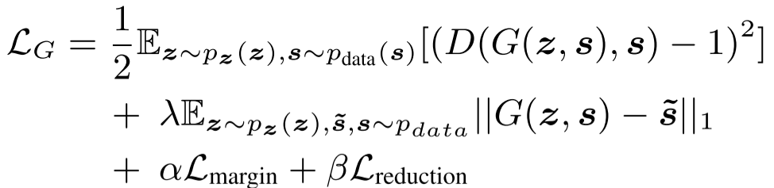
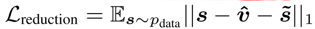
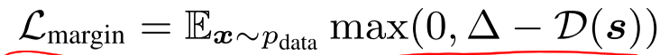
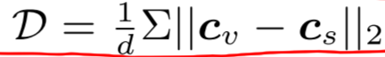

<head>
    
    
</head>

这篇文章提出的模型叫**S-ForkGAN**，该模型工作在log-power spectra上，模型结构如下图所示：

* 1帧语音波形经过512点FFT并被转换为257点log-power spectra

* 11帧的log-power spectra被拼接在一起构成2827$\times$1的vector作为encoder的输入

* the shared encoder consists of 11 one-dimensional strided convolutional layers of filter width-31 and stride length 2

* encoder中张量的维度变换为2827$\times$1$\rightarrow$1414$\times$16$\rightarrow$707$\times$32$\rightarrow$354 × 32$\rightarrow$177$\times$64$\rightarrow$89$\times$64$\rightarrow$45$\times$128$\rightarrow$23$\times$128$\rightarrow$12$\times$256$\rightarrow$6$\times$256$\rightarrow$3$\times$512$\rightarrow$2$\times$1024

* a flattening operation is used for converting a 2$\times$1024 vector to two length-2048 vectors via fully-connected layers
* the two encoded latent vectors (two length-2048 vectors) are concatenated with two noise samples, which are from an a prior 2$\times$1024-dimensional normal distribution $N(0, I)$
* the concatenated vectors are the input of each decoder
* the network parameters of the decoder are symmetric to the encoder
* note that each layer input is concatenated with skip connections from the encoder
* 两个decoder的输出分别作为clean speech prediction和noise prediction

算法流程如下：

其中$s$代表带噪谱，$\hat{s}$代表增强语音谱，$\tilde{s}$代表ground truth语音谱，$\hat{v}$代表增强噪声谱，$\tilde{v}$代表$s-\tilde{s}$，也就是ground truth噪声谱

通过以上说明，基本就可以搞懂本篇文章的模型流程，下面看loss函数：

其中G的损失函数中

可以看到GAN还是基于LSGAN和cGAN的

这篇文章的创新点在于，将传统的谱减法的思想引入神经网络来做语音增强，模型使用一个encoder生成的latent vector加以噪声再分别经过两个decoder生成clean speech prediction和noise prediction的谱，即提取噪声又提取语音，并通过loss函数约束模型，非常妙！
